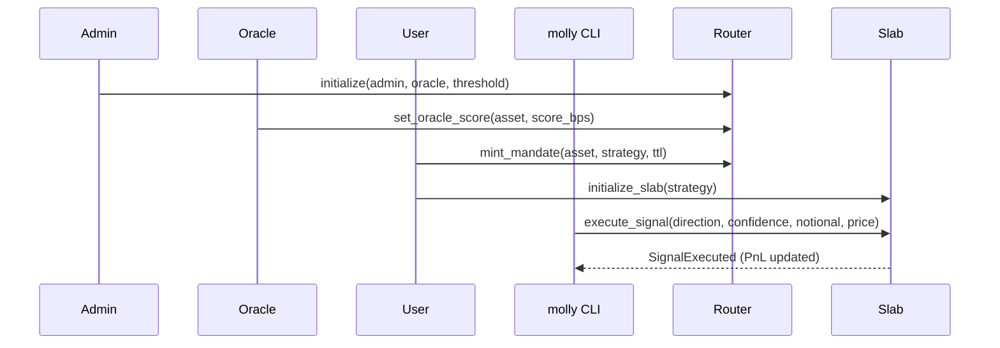
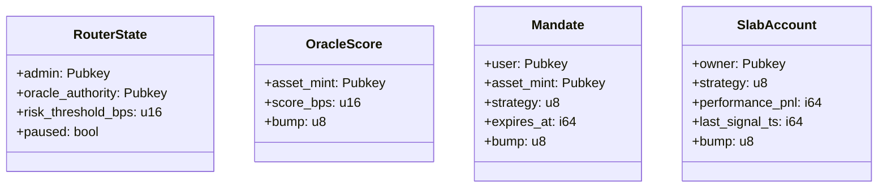
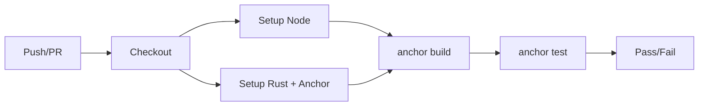

MollySlab — Sharded AI Trading on Solana


**Version:** 1.0.1-alpha · **License:** Apache-2.0 · **Status:** Alpha (prod-ready architecture; mainnet requires real oracle + audit)

[](#)
[](#)
[](#)

MollySlab is a full-stack framework for running **AI-driven trading agents on Solana** with safety rails:
- **Router** program — mandates, risk gating, admin pause/veto.
- **Slab** program — isolated per-user execution + PnL tracking.
- **Rust CLI** (`molly`) — friendly UX with ASCII banner.
- **TypeScript Orchestrator** — optional Claude integration.
- **Tests + CI + Docs** — batteries included.


---

## Table of Contents
- [Why MollySlab?](#why-mollyslab)
- [Architecture](#architecture)
- [Core Concepts](#core-concepts)
- [Diagrams (Mermaid)](#diagrams-mermaid)
- [Quick Start](#quick-start)
- [CLI Usage (`molly`)](#cli-usage-molly)
- [TypeScript Orchestrator](#typescript-orchestrator)
- [Testing](#testing)
- [Security Features](#security-features)
- [Configuration](#configuration)
- [Troubleshooting](#troubleshooting)
- [Roadmap](#roadmap)
- [FAQ](#faq)
- [License](#license)

---

## Why MollySlab?
AI agents are powerful but risky. MollySlab enforces **ephemeral, scoped permissions** (mandates) with **oracle-gated risk** and **per-user execution slabs** to limit blast radius and keep decision (AI) separate from execution (on-chain).

---

## Architecture

- **Router** (policy): initializes admin/oracle, sets threshold, mints/revokes mandates, pause/veto.
- **Slab** (execution): per-wallet PDA sandbox; validates mandate TTL + confidence; tracks PnL.
- **Orchestrator** (TS): generates signals (Claude or mock) and forwards to CLI.
- **CLI** (Rust): init, mandate, deploy, execute, status, revoke, close.

---

## Core Concepts

**Mandate**  
Short-lived authorization for *one* wallet → *one* asset → *one* strategy. Default TTL: 300s (5 min).  
PDA seeds: `["mandate", user, asset_mint, [strategy_byte]]`

**Oracle Risk Gating**  
`OracleScore.score_bps` must be ≥ `RouterState.risk_threshold_bps` (both in basis points).

**Confidence Threshold (Slab)**  
Rejects signals with `confidence_bps < 8500` (85% default).

---


### 2) End‑to‑End Trade Flow


### 3) Accounts & PDAs


### 4) CI Pipeline


> **Note:** These blocks avoid `subgraph`/shape edge cases to ensure GitHub rendering works. Each statement is on its own line.

---

## Quick Start

```bash
# Prereqs: Solana 1.18+, Anchor 0.30+, Node 18+, Rust stable
npm i                # or: pnpm i
anchor build
solana-test-validator -r --reset
anchor deploy

# Build the CLI
make cli
./target/release/molly --help

# Bootstrap Router (admin & oracle use your wallet in local dev)
./target/release/molly init --admin $(solana address) --oracle $(solana address) --threshold-bps 7000
```

---

## CLI Usage (`molly`)

```bash
# Identity
molly whoami

# Admin controls
molly pause true
molly threshold 8000

# Oracle score
molly oracle-set <ASSET_MINT> 9000

# Mandate (TTL=300s default example)
molly mandate-mint <ASSET_MINT> momentum 300

# Slab lifecycle
molly deploy momentum
molly execute --strategy momentum <ASSET_MINT> long 9000 1000 100
molly revoke <USER_PUBKEY> <ASSET_MINT> momentum
molly close
```

**CLI boot banner:** prints an ASCII “MOLLYSLAB” header when it starts.

---

## TypeScript Orchestrator

```ts
// offchain/src/orchestrator.ts (excerpt)
const signal = await claudeSignal('Generate a high-confidence SOL momentum signal.');
spawnSync('./target/release/molly', [
  'execute', '--strategy', signal.strategy.toLowerCase(),
  signal.assetMint, signal.direction.toLowerCase(),
  String(signal.confidenceBps), String(signal.notional), String(signal.price)
], { stdio: 'inherit' });
```

**Env vars**
```bash
cp .env.example .env
RPC_URL=http://127.0.0.1:8899
WALLET=~/.config/solana/id.json
CLAUDE_API_KEY=sk-ant-...
```

---

## Testing

```bash
anchor test --skip-local-validator
```
Included:
- `tests/mandate-oracle.ts` — E2E happy path
- `tests/admin-controls.ts` — pause/threshold + below-threshold failure
- `tests/slab-edges.ts` — low confidence + expired mandate

---

## Security Features
- **Ephemeral mandates** (TTL default 5 min)
- **Oracle-gated risk** (score vs threshold)
- **Admin controls**: pause/unpause, threshold update, veto
- **Isolation**: user-scoped **Slab** PDA; no cross-account writes
- **MEV patterns** (commit-reveal/TWAP/Jito) ready for integration

> **Mainnet:** integrate a real oracle (e.g., Pyth) and complete an external **audit**.

---

## Configuration
- `Anchor.toml`: workspace & program IDs
- `Cargo.toml` (workspace): shared deps
- `package.json`: TS toolchain
- `.env.example`: runtime variables
- `.github/workflows/ci.yml`: CI

---

## Troubleshooting
- **Mermaid parse error**: make sure each diagram line is on its own line; avoid `subgraph` and exotic node shapes on GitHub.
- **IDL not found**: run `anchor build` to generate `target/idl`.
- **PDA mismatch**: verify seeds and strategy enum indexes.
- **Signature errors**: ensure `WALLET` points to a valid keypair.
- **Local RPC flakiness**: restart validator `solana-test-validator -r --reset`.

---

## Roadmap
- Real oracle integration (Pyth) + DEX CPIs (Jupiter/Raydium)
- Jito bundles for MEV-resistant execution
- Multi-asset slabs & advanced strategies
- Observability dashboards (Grafana/Prometheus)

---

## FAQ
**Do I need a mandate for every trade?** Yes. Mandates are per-asset, per-strategy, short-lived.  
**Can I run without Claude?** Yes. Orchestrator falls back to **mock** signals.  
**Why 85% confidence?** Safe default; change in Slab program if needed.

---

## License
Apache-2.0 — see `LICENSE`.
