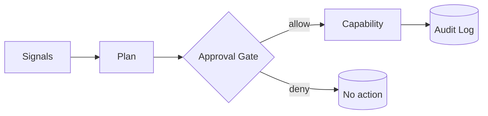
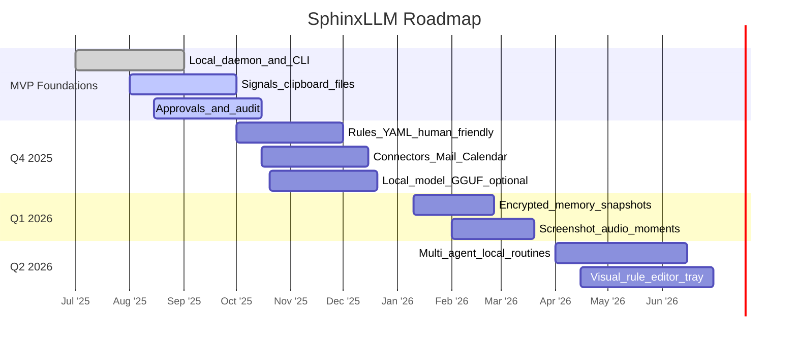

# SphinxLLM — The System‑Native LLM (Backend‑Only)

SphinxLLM is an on‑device, privacy‑first model that lives in your OS, senses context (files, clipboard, calendar, windows), and executes audited automations you approve. This README covers the **runtime**, **CLI**, **rules**, **connectors**, **security**, and **roadmap** — no UI required.


---

## Core Principles

- **Local‑first**: all inference and planning happen on your machine.
- **System‑native**: sensors gather ambient context (opt‑in and scoped).
- **Human‑in‑the‑loop**: sensitive actions require explicit approval.
- **Least privilege**: capability tokens gate every operation.
- **Auditable**: every plan and action is logged locally for review.

---

## Install

Choose one path:

1) **Download a prebuilt binary** (recommended):
- Linux (AppImage), macOS (Apple Silicon), Windows (x64/Arm64).
- Place it on your PATH as `sphinx` and run `sphinx version`.

2) **Build from source** (example):
```bash
# prerequisites vary by platform; example shows typical dev flow
git clone https://example.com/sphinxllm/runtime.git
cd runtime
make build   # or cargo build / bun build / uvx, depending on the repo
./target/release/sphinx --help
```

---

## Quickstart (CLI)

```bash
sphinx init
sphinx status
sphinx sensors list
sphinx rules add examples/rules.yaml
sphinx run  # start local daemon
```

When the daemon is running, try:

```bash
sphinx ask "Summarize what I worked on today"
sphinx plan "If calendar says focus, silence notifications and start a 25‑min timer"
sphinx memory snapshot --out snapshots/$(date +%F).bin
```

---

## Configuration

Default config file locations:

- **Linux**: `~/.config/sphinxllm/config.yaml`
- **macOS**: `~/Library/Application Support/SphinxLLM/config.yaml`
- **Windows**: `%APPDATA%\SphinxLLM\config.yaml`

Minimal `config.yaml`:
```yaml
model:
  backend: gguf        # or onnx
  path: ~/.sphinx/models/sphinx-8b-int8.gguf
  kv_cache_mb: 512
  gpu: auto
approval:
  require_for: [mail.send, filesystem.delete, network.requests]
logging:
  level: info
  path: ~/.sphinx/logs
memory:
  store: ~/.sphinx/memory
```

Example `rules.yaml` (human‑friendly):
```yaml
- when: clipboard.contains: "invoice"
  then:
    - plan: "file the invoice into ~/Finance/2025"
    - ask: "Do you want me to rename it with date + vendor?"
    - require_approval: true

- when: calendar.event.starts_in_minutes: 5
  and: calendar.event.is_meeting: true
  then:
    - plan: "open notes, outline agenda, and prepare recent docs"
    - require_approval: false
```

Load rules:
```bash
sphinx rules add ./rules.yaml
sphinx rules list
```

---

## Capabilities & Connectors

Register audited operations your runtime is allowed to perform. Each capability lives behind a token you can revoke.

**TypeScript connector (example)**
```ts
import { Sphinx } from "@sphinx/sdk";
const sphinx = await Sphinx.attach();

sphinx.capability("filesystem.move", async (from: string, to: string) => {
  // implement safe file move with validations
});

sphinx.on("clipboard:change", ({ text }) => {
  if (text?.includes("invoice")) sphinx.plan("file the invoice into ~/Finance/2025");
});
```

**Python connector (example)**
```py
from sphinx import Sphinx
sphinx = Sphinx.attach()

@sphinx.capability("mail.draft")
def draft_mail(to: str, subject: str, body: str):
    # implement a local mail draft connector
    ...

@sphinx.on("calendar:meeting_start")
def on_meeting(evt):
    sphinx.plan("open notes, start recorder, outline agenda")
```

---

## Security Model



- **Signals**: clipboard, files, calendar, notifications, window focus (all opt‑in).
- **Approval Gate**: blocklist/allowlist + interactive prompts for sensitive ops.
- **Capability**: narrow, revocable operation (e.g., `filesystem.move`, `mail.draft`).
- **Audit Log**: immutable local log of plans, diffs, and outcomes.

---

## Storage Layout

```text
~/.sphinx/
  models/         # downloaded or user‑provided weights
  memory/         # encrypted long‑term memory snapshots
  logs/           # daemon + action logs
  approvals/      # pending/approved decisions
  rules/          # user‑authored rules
```

---

## Roadmap



---

## Troubleshooting

- **Model won’t load**: check `config.yaml` paths and backend (gguf/onnx).
- **High CPU/GPU**: lower `kv_cache_mb`, reduce context length, prefer int8.
- **Rules not firing**: confirm `sphinx sensors list` shows events; run with `--verbose`.
- **Approvals stuck**: inspect `~/.sphinx/approvals/` and clear stale entries.
- **Memory snapshots**: only decryptable on the same device unless you export keys.

---

## Contributing

1. Fork & branch: `git checkout -b feat/my-change`
2. Use conventional commits: `feat:`, `fix:`, `docs:`
3. Include minimal tests for connectors/rules
4. Open a PR and describe your scenario (signals→plan→capability)

---

## License

MIT — © 2025 SphinxLLM contributors.
