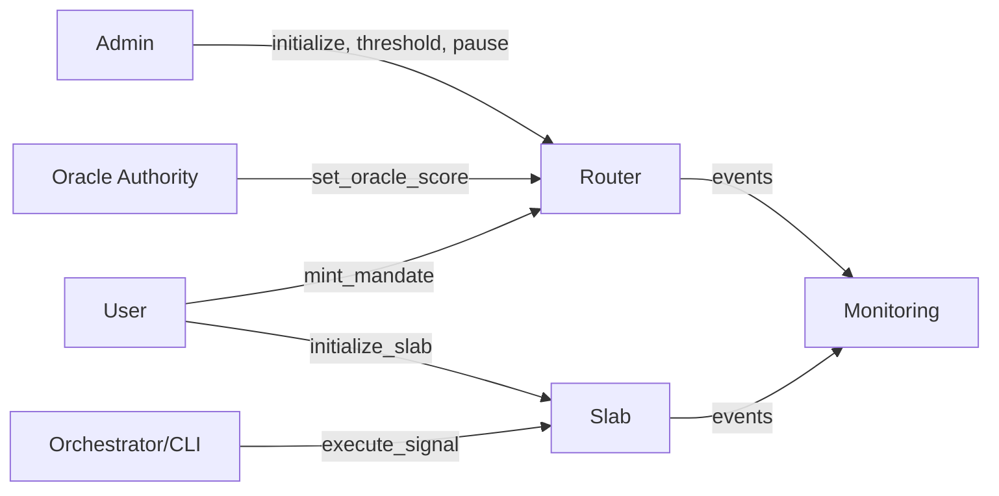
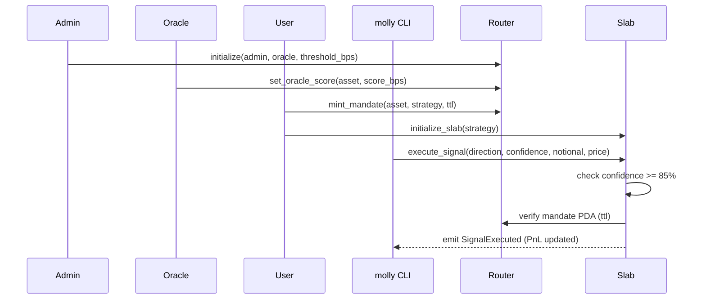
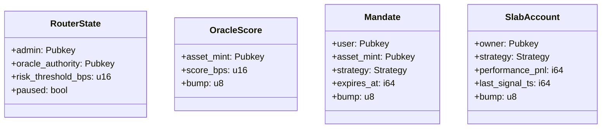
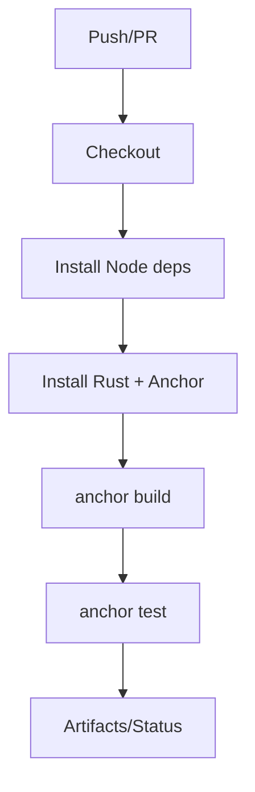

MollySlab — Sharded AI Trading on Solana
**Version:** 1.0.1‑alpha · **License:** Apache‑2.0 · **Status:** Alpha (production‑ready architecture; mainnet requires real oracle + audit)

[](#)
[](#)
[](#)

MollySlab is a full‑stack framework for running **AI‑driven trading agents on Solana** with strong safety rails.  
It ships two on‑chain programs (**router**, **slab**), a **Rust CLI** (`molly`), a **TypeScript orchestrator** (Claude integration), tests, docs, and CI.

---

## Table of Contents
- [Why MollySlab?](#why-mollyslab)
- [High‑Level Architecture](#high-level-architecture)
- [Core Concepts](#core-concepts)
  - [Mandates](#mandates)
  - [Router Program](#router-program)
  - [Slab Program](#slab-program)
  - [Risk & Oracles](#risk--oracles)
- [Mermaid Diagrams](#mermaid-diagrams)
  - [System Diagram](#system-diagram)
  - [E2E Trade Flow](#e2e-trade-flow)
  - [Accounts & PDAs](#accounts--pdas)
  - [CI Pipeline](#ci-pipeline)
- [Quick Start](#quick-start)
- [CLI Usage (`molly`)](#cli-usage-molly)
- [TypeScript Orchestrator](#typescript-orchestrator)
- [Testing](#testing)
- [Security Features](#security-features)
- [Configuration](#configuration)
- [Troubleshooting](#troubleshooting)
- [Roadmap](#roadmap)
- [FAQ](#faq)
- [License](#license)

---

## Why MollySlab?
AI agents are powerful—but without boundaries, they can be risky. **MollySlab** enforces **ephemeral, scoped permissions** (“mandates”) with **oracle‑gated risk** and **isolated execution slabs** to prevent over‑reach and limit blast radius. It’s ideal for:
- Bots that need **short‑lived authorization** (e.g., 5‑minute trading windows)
- Teams who want **guardrails** (pause/veto, thresholds) and **observability** (events/PnL)
- A clean separation of **decision (AI) vs. execution (on‑chain)**

---

## High‑Level Architecture

```mermaid
flowchart TD
  subgraph Offchain[Offchain]
    A[Claude / AI] -->|Signal JSON| O[Orchestrator (TS)]
    O -->|molly CLI| C[(RPC)]
  end

  subgraph Onchain[On-chain (Solana)]
    R[Router Program] -->|Mint mandate| M[Mandate PDA]
    O2[Oracle Authority] -->|Score asset| S[OracleScore PDA]
    U[User Wallet] -->|Init slab| L[Slab PDA]
    L -->|Execute signal| E[(Events & PnL)]
    R -->|Admin pause/threshold| R
  end

  C --> R
  C --> L
  M -. gated by score/ttl .-> L
  S -. threshold check .-> R
```

**Separation of concerns:**
- **Router**: policy layer (mandates, risk, admin)
- **Slab**: execution sandbox (owner‑scoped, strategy‑typed)
- **Orchestrator**: AI signal generation & submission
- **CLI**: developer & user UX

---

## Core Concepts

### Mandates
A **Mandate** authorizes *one* wallet to trade *one* asset using *one* strategy, expiring after a short TTL (default 5 minutes).  
- PDA seeds: `["mandate", user, asset_mint, [strategy_byte]]`
- Fields: `user`, `asset_mint`, `strategy`, `expires_at`, `bump`
- Revocation: user or admin may revoke early.

### Router Program
Controls **risk & authorization**:
- Initialize with `admin`, `oracle_authority`, `risk_threshold_bps`
- Set **oracle score** per asset
- Mint / revoke **mandates**
- **Pause** the system, **update threshold**, and **veto** a mandate

### Slab Program
Isolated **execution environment** per user:
- PDA seeds: `["slab", owner]`
- Strategy variants: `Momentum | Arbitrage | Lp | MeanReversion`
- Executes signals only if:
  - mandate exists & not expired
  - confidence ≥ 85% (configurable in code)
- Tracks **performance PnL** & emits events

### Risk & Oracles
Router checks `OracleScore.score_bps >= RouterState.risk_threshold_bps`.  
- Score and threshold are **basis points** (0..10000).
- If score below threshold, mandate mint **fails**.

---

## Mermaid Diagrams

### System Diagram


### E2E Trade Flow


### Accounts & PDAs


### CI Pipeline


---

## Quick Start

```bash
# 0) Prereqs: Solana 1.18+, Anchor 0.30+, Node 18+, Rust stable
npm i           # or: pnpm i
anchor build
solana-test-validator -r --reset
anchor deploy

# 1) Build CLI
make cli
./target/release/molly --help

# 2) Bootstrap (use your wallet for admin & oracle in local dev)
./target/release/molly init --admin $(solana address) --oracle $(solana address) --threshold-bps 7000
```

---

## CLI Usage (`molly`)

```bash
# Show identity & cluster
molly whoami

# Admin: pause/unpause & threshold
molly pause true
molly threshold 8000

# Oracle: set risk score for an asset mint
molly oracle-set <ASSET_MINT> 9000

# User: mint mandate (5 minutes = 300s)
molly mandate-mint <ASSET_MINT> momentum 300

# Deploy slab (once per user)
molly deploy momentum

# Execute a signal (AI or manual)
molly execute --strategy momentum <ASSET_MINT> long 9000 1000 100

# Revoke & close
molly revoke <USER_PUBKEY> <ASSET_MINT> momentum
molly close
```

**Boot Banner:** The CLI prints an ASCII **MOLLYSLAB** header on startup.

---

## TypeScript Orchestrator

Call Claude (or mock) to get a signal and forward to the CLI:

```ts
// offchain/src/orchestrator.ts (excerpt)
const signal = await claudeSignal('Generate a high-confidence SOL momentum signal.');
spawnSync('./target/release/molly', [
  'execute', '--strategy', signal.strategy.toLowerCase(),
  signal.assetMint, signal.direction.toLowerCase(),
  String(signal.confidenceBps), String(signal.notional), String(signal.price)
], { stdio: 'inherit' });
```

**Env:**
```bash
cp .env.example .env
# fill these
RPC_URL=http://127.0.0.1:8899
WALLET=~/.config/solana/id.json
CLAUDE_API_KEY=sk-ant-...
```

---

## Testing

```bash
anchor test --skip-local-validator
```

Included tests:
- `tests/mandate-oracle.ts` — happy path
- `tests/admin-controls.ts` — pause/threshold and below‑threshold failure
- `tests/slab-edges.ts` — low confidence & expired mandate failures

---

## Security Features
- **Ephemeral mandates** (TTL default 5 minutes)
- **Oracle‑gated risk** (score vs. threshold)
- **Admin controls**: pause/unpause, threshold update, veto
- **Isolation**: per‑user **Slab** PDA; no cross‑account writes
- **MEV patterns** (commit‑reveal/TWAP/Jito) ready for integration

> **Mainnet note:** integrate a real oracle (e.g., Pyth) and add an external **audit** before mainnet.

---

## Configuration
- `Anchor.toml` sets workspace & local program IDs.
- `Cargo.toml` (workspace) shares dep versions.
- `package.json` for offchain tooling and tests.
- `.env.example` lists runtime variables.
- `.github/workflows/ci.yml` for CI.

---

## Troubleshooting
- **IDL not found**: run `anchor build` to generate `target/idl`.
- **PDA mismatch**: confirm seeds and strategy enum index.
- **Signature fail / unknown signer**: ensure `WALLET` points to correct keypair.
- **RPC errors on local**: restart validator with `solana-test-validator -r --reset`.

---

## Roadmap
- Real oracle integration (Pyth) & DEX CPIs (Jupiter/Raydium)
- Jito bundles for MEV‑resistant execution
- Multi‑asset slabs & advanced strategies
- Observability dashboards (Grafana/Prometheus)

---

## FAQ
**Q:** Do I need a mandate for every trade?  
**A:** Yes—mandates are short‑lived, per‑asset & per‑strategy. They’re the core safety primitive.

**Q:** Can I run without Claude?  
**A:** Yes. The orchestrator falls back to **mock** signals if `CLAUDE_API_KEY` is missing.

**Q:** Why enforce 85% confidence?  
**A:** It’s a sane default. Adjust the threshold in the Slab program as needed.

---

## License
Apache‑2.0 — see `LICENSE`.
